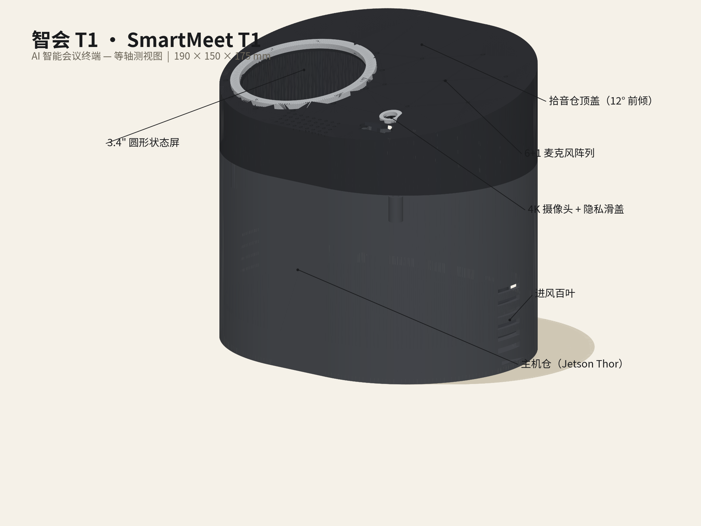
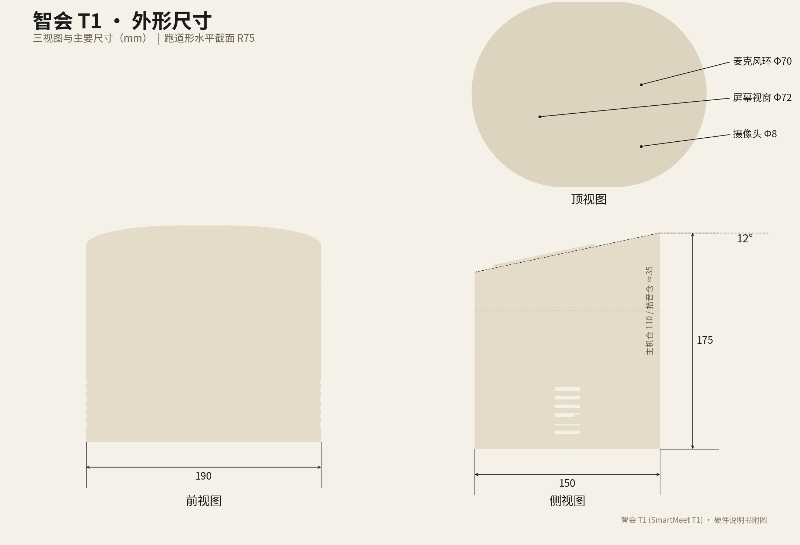
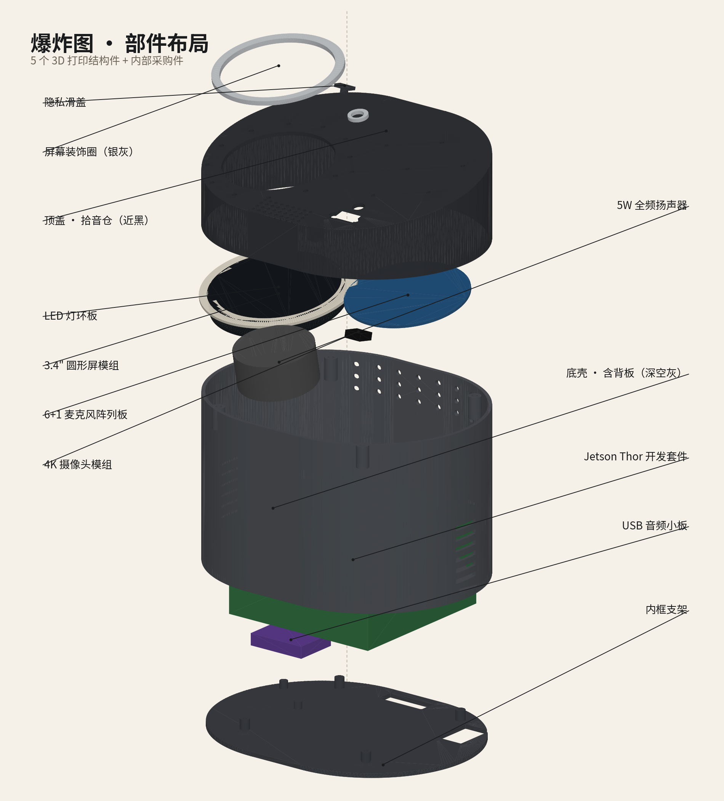
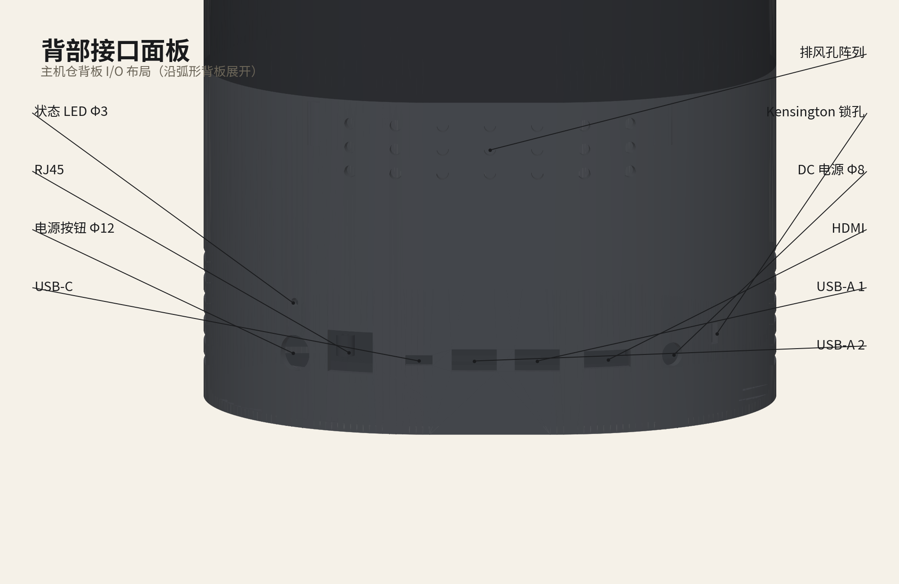
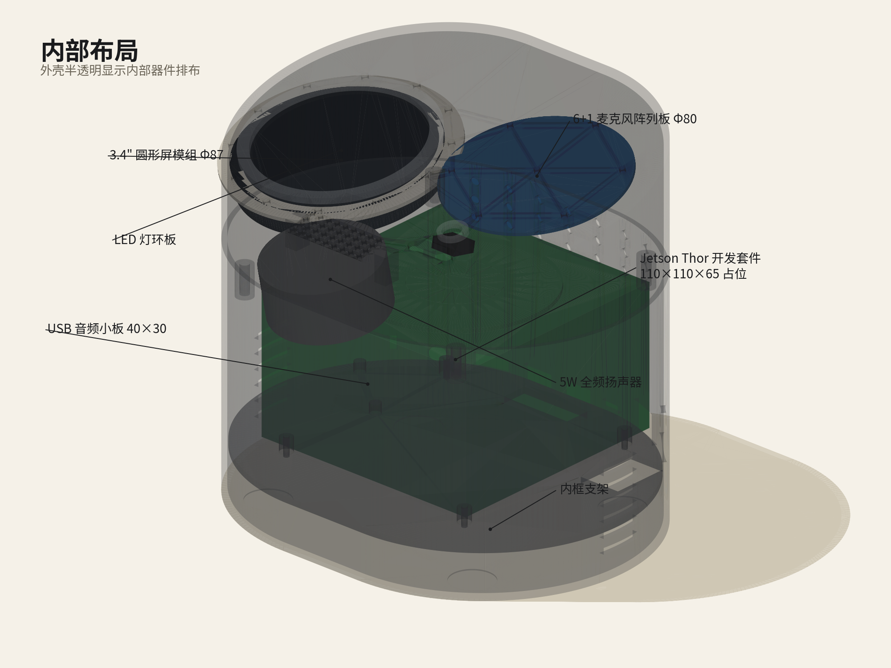

# 智会 T1 (SmartMeet T1) · 项目 README
### ——写给完全不懂硬件的软件工程师的硬件设计入门读本

> 这份文档假设你从未接触过硬件设计。它一边讲这个项目做了什么、怎么做的，
> 一边把理解每个环节所需的硬件基础知识讲清楚。
> 读完后你应该能：看懂这套设计文件、知道每个文件是干什么的、
> 并能自己动手改一个尺寸、重新生成模型、拿去 3D 打印。

---

## 1. 这个项目是什么

我们团队做了一套「AI 智能会议系统」软件：开会时实时把语音转成文字、
区分是谁在说话（说话人分离）、会后自动生成会议纪要。这套软件完全离线
跑在一台 NVIDIA Jetson AGX Thor 开发套件上（一块带强大 AI 算力的卡片式电脑，
可以粗略理解为"一台浓缩到巴掌大、专门跑 AI 的小型工作站"）。

软件跑在芯片上，但芯片不能裸着摆在会议桌上。这个项目要做的，
就是给这套软件造一个 **"身体"**：一台放在公司会议室（20 人以内）桌上的
硬件终端——它有外壳、有麦克风阵列、有扬声器、有状态屏、有摄像头，
内部把 Thor 开发套件和这些器件安排得井井有条。

这台终端叫 **智会 T1 (SmartMeet T1)**，长这样：



需要说明的是：本项目交付的是**结构设计与工程文档**（外壳和内部布局怎么设计、
怎么装配、买什么零件），不包括电路设计和软件代码。交付物主要是：
一个可以参数化调整的 3D 模型、一套渲染图、一份物料清单（BOM）、
一本硬件说明书，以及生成它们的全部脚本。

---

## 2. 硬件设计基础知识扫盲

这一章是给小白补课用的，占篇幅最大。读完它，后面每一章你都能看懂。

### 2.1 一台电子产品由什么组成

拆开任何一台电子产品（手机、路由器、会议宝），里面的东西大致分两类：

- **电子部分**：芯片、电路板（PCB，Printed Circuit Board，印制电路板——
  就是那块绿色的、焊满元件的板子）、屏幕、摄像头、线材。这部分的设计叫
  **电子设计 / 硬件设计（狭义）**：画电路原理图、画 PCB 走线、选芯片。
- **结构部分**：外壳、支架、螺丝、散热风道、出声孔。这部分的设计叫
  **结构设计（ID/MD，工业设计/机械设计）**：决定产品长什么样、
  内部器件怎么摆、外壳怎么拆怎么装、怎么散热。

本项目**只做结构部分 + 成品件选型**：电路部分全部采购现成模块
（Thor 开发套件、麦克风阵列板、屏幕模组等），我们设计的是把它们
装在一起的"房子"，并画好图纸、列好购物清单。

### 2.2 什么是 CAD，什么是参数化建模

**CAD**（Computer-Aided Design，计算机辅助设计）就是用电脑画工程图。
画出来的不是一张"图片"，而是一个有精确尺寸的 **3D 数字模型**。

**参数化建模**是 CAD 的一种工作方式，可以类比成
**"用 Excel 公式驱动的图纸"**：普通画图是"画一条 190 mm 的线"；
参数化建模是先定义一个参数 `Width = 190`，然后画"一条长度 = Width 的线"。
这样当你把 `Width` 改成 260，模型里所有引用它的尺寸——外壳宽度、
内部支架宽度、开孔位置——会**全部自动跟着变**，不用一处一处手改。

为什么这很重要？因为硬件设计永远要改。客户说"能不能再宽一点"，
非参数化模型可能要重画三天，参数化模型改一个数、点一下重建就完事。
本项目的全部关键尺寸（整机宽高深、壁厚、麦克风环直径、每个孔的位置）
都集中存放在模型里一张叫 `Master` 的电子表格中，改表即改模。

### 2.3 FreeCAD 是什么，为什么选它

**FreeCAD** 是一款免费开源的参数化 3D CAD 软件。选它的原因：

1. **免费开源**：不用买 SolidWorks/Creo 这类商业软件（每席每年数万元），
   公司内部推广没有授权合规问题；
2. **可离线运行**：我们的部署环境是内网，商业 CAD 的云授权常常连不上；
3. **参数化内核完整**：支持电子表格驱动模型（就是 2.2 讲的机制）；
4. **能导出加工文件**：STEP、STL 都能出（下一节讲）；
5. **带命令行脚本模式**：本次建模没有用鼠标画，而是写了一个 Python 脚本
   （`build.py`）让 FreeCAD 自动执行——好处是**可复现**：任何时候从头跑一遍脚本，
   就能一字不差地重建整个模型，这类似于软件里的"基础设施即代码"。

### 2.4 文件格式扫盲：FCStd / STEP / STL

项目里有三种 3D 文件，类比文档世界：

| 格式 | 类比 | 干什么用 | 谁需要它 |
|------|------|---------|---------|
| `.FCStd` | Word 的 `.docx` 源文件 | FreeCAD 的原生格式，保存了全部参数、表格、建模历史，**可继续编辑** | 要改设计的人 |
| `.step` (STEP) | 通用文档格式（类似 `.pdf` 但可编辑） | ISO 标准的 CAD 交换格式，保留精确曲面几何，**任何 CAD 软件都能打开** | 结构厂、模具厂、用别的 CAD 的工程师 |
| `.stl` (STL) | 打印专用格式（类似"纯文本"） | 把模型表面切成几十万个小三角片，只有形状没有参数，**3D 打印机的通用输入** | 3D 打印店 / 切片软件 |

一句话：**改图用 FCStd，给工程师/工厂用 STEP，3D 打印用 STL。**
本项目三种都交付了：模型本体是 `SmartMeet_T1.FCStd`，
`export/` 目录下有整机装配 STEP 和每个零件的 STEP+STL。

### 2.5 从 3D 打印打样到开模量产

硬件外壳不会一上来就量产，标准路径是：

**打样（Prototype）→ 小批试产 → 开模量产。**

- **3D 打印打样**：用 3D 打印机把塑料一层层堆出来。单件成本几十到几百元，
  一到三天拿到手，用来验证尺寸、装配、外观。本项目 Rev A（A 版）就是按
  3D 打印设计的，壁厚 2.4 mm（打印件常用壁厚）。
- **开模量产**：做一副钢模具，用注塑机把熔融塑料注进去成型。单件成本降到
  几元钱，但一副模具十几万到几十万元，且**模具开出来就改不了了**。
  所以量产设计有一堆额外规矩，打样阶段可以不管，比如：
  - **拔模角**：注塑件要从模具里"拔"出来，侧壁必须带一点斜度（通常 1–3°），
    直挺挺的壁会卡在模具里；
  - **卡扣 vs 螺丝**：量产件喜欢用塑料卡扣（免螺丝、装配快），
    打样件用螺丝更稳妥（卡扣尺寸没调好容易断或合不拢）；
  - **热熔铜螺母**：塑料上直接拧螺丝，拧两次就滑牙了。做法是先在塑料上
    预留一个孔，用烙铁把一颗**铜螺母**（外面带滚花的小铜件）烫进去，
    铜螺母内的螺纹经久耐用。本项目全部装配点都是"M3 内六角螺丝 + 热熔铜螺母"
    （M3 = 公称直径 3 mm 的螺丝规格）。

### 2.6 散热基础：为什么 130W 必须留风道

芯片消耗的电能最终几乎全部变成热。Jetson Thor 满负荷功耗 40–130 W——
130 W 相当于一个**大功率电烙铁**塞在一个饭盒大的空间里。如果外壳做成密闭的，
内部温度几分钟就能升到芯片保护性关机的程度。

解决办法是**风道**：给空气设计一条流过机器的通道。本设计是"**下进风、后上出**"：

- 机身左右侧壁**下部**开进风百叶（一条条 3×20 mm 的长缝），冷空气从这里进入；
- 流经发热的 Thor 开发套件（它自己还带一个小风扇往上吹）；
- 热空气从**背部上沿**的排风孔阵列排出。

为什么"下进上出"？因为**热空气密度小、天然往上走**，风道顺着这个趋势，
即使风扇停转也有一定的自然对流兜底。百叶开口朝下/朝侧面而不是朝上，
还能防桌上的水和灰尘直接落进去。

### 2.7 声学基础：麦克风阵列与波束成形

**麦克风阵列**就是把多个麦克风按固定几何位置排在一起协同工作。
本项目是 6+1 阵列：6 个麦克风均匀分布在一个直径 70 mm 的圆周上，
圆心再加 1 个参考麦克风。

**波束成形（beamforming）**一句话原理：同一个声音到达圆周上不同位置的
麦克风有**微小的时间差**（声速 340 m/s，70 mm 的直径产生约 0.2 ms 级差异），
处理器利用这些时间差反推声音来自哪个方向，然后**把那个方向的拾音增强、
其他方向的噪声压低**——相当于给麦克风装了一个"看不见的、可以转动指向的聚光灯"。
会议室里 20 个人围坐一圈，系统靠它一边听清发言者、一边知道"这句话是谁说的"
（这正是软件"说话人分离"功能的硬件基础）。

几个由此而来的设计决定：

- **麦克风放顶部**：会议桌中央的设备，顶部无遮挡，360° 都能收到直达声；
  放侧面会被自己外壳挡住一半。
- **放在 12° 斜面上**：斜面让拾音轴朝前上方抬起，正对坐姿与会者的头部高度。
- **扬声器和麦克风要拉开距离**：扬声器播的声音如果直接灌进麦克风，
  软件就很难分清"这是机器自己放的还是人说的"（回声）。所以扬声器安排在
  拾音仓前部、与麦克风孔保持 90 mm 以上间距，配合芯片的回声消除（AEC）算法。
- **出声孔为什么要开"阵列"**：扬声器正面如果开一个大洞，难看且进灰；
  开一片小孔（36 个 Φ2 mm 圆孔），声音能透出来（开孔率约 18%），
  外观还是一整块干净的斜面。

### 2.8 BOM 是什么

**BOM**（Bill of Materials，物料清单）就是**购物清单 + 装配配方**：
每台机器需要买哪些零件、各买几个、参考多少钱、有什么替代型号。
工厂照它备料，财务照它算成本，采购照它下单。本项目的 BOM 在
`BOM.csv`（表格版）和 `BOM.md`（带备注的阅读版）。

---

## 3. 设计过程复盘：设计是一连串取舍

硬件设计不是"画一个漂亮外壳"，而是在一堆互相打架的约束里找平衡。
按实际顺序复盘一遍：

**第一步，从需求出发。** 20 人以内会议室、全离线（数据不出内网）、
能接显示器投屏、外观要"沉稳政企风"（参考科大讯飞会议宝、华为办公硬件，
不要萌系消费电子产品风）。

**第二步，定配置。** 软件已经跑在 Thor 开发套件上，所以核心件没得选；
拾音要 6+1 麦克风阵列（软件说话人分离的需要）；要一块状态屏显示
转写状态；要摄像头（视频留痕）但必须能**物理遮挡**（政企客户的硬要求——
软件关摄像头人家不信，要看到镜头被实实在在挡住）；要扬声器播报纪要。

**第三步，定外形。** 跑道形（stadium：一个长方形两端各接半圆，也叫腰圆形）
水平截面——比纯圆好放接口，比纯方亲和；12° 前倾的顶面——屏幕和麦克风
朝向与会者。尺寸 190×150×175 mm：比 Thor 开发套件大一圈、又不侵占桌面。

**第四步，内部布局的空间博弈（最费脑子的一步）。** 顶盖斜面只有 150 mm 进深，
却要同时放下：Φ87 mm 的屏幕模组、Φ70 mm 的麦克风环、摄像头和滑盖、
还有扬声器的出声孔。排来排去发现"麦克风环在正中、屏幕在其正前方"的
对称布局**放不下**（70+72 加上必要间隙超过 150）。最终的解法是非对称布局：
屏幕居中偏左、麦克风环在右后、摄像头在右前——三者互不干涉，
这是唯一可行解（过程详见硬件说明书 D2–D4 节）。这就是取舍：
牺牲一点绝对对称，换来所有器件都装得下。

**第五步，建模。** 写 `build.py` 脚本驱动 FreeCAD 自动生成 5 个零件
（底壳、内框、顶盖、屏幕装饰圈、隐私滑盖）+ 7 个内部器件占位模型，
全部尺寸来自 `Master` 参数表。

**第六步，渲染与文档。** 从模型导出 STL，用自写的渲染脚本生成
米白底、黑色标注线的工程风格渲染图（仿 Hugging Face Reachy Mini
硬件文档的审美），最后写 BOM 和硬件说明书。

---

## 4. 设计详解

### 4.1 整机外形



- **跑道形截面**（R75 半圆 + 40 mm 直边）：俯视像一颗胶囊。两端是半圆，
  前后是直边——但直边只有 40 mm 宽，这一点直接决定了后面接口布局的取舍（见 4.3）。
- **12° 前倾顶盖**：整个顶面是一块从后上方向前下方倾斜的平面，
  屏幕、麦克风、摄像头、出声孔全部布置在这块斜面上，朝向与会者。
- **上下两段**：下半是主机仓（高约 110 mm，深空灰），上半是拾音仓
  （顶盖内约 35 mm，近黑），中间一道分件缝也是装配缝。
- **配色**：主机身深空灰、顶盖近黑、屏幕一圈银灰装饰圈——三色克制搭配，
  是政企产品的典型做法。

### 4.2 爆炸图：5 个结构件 + 内部采购件



从下往上读这张图：

1. **内框支架**：一块跑道形板，上面有 4 根铜柱（固定 Thor 套件，
   孔位 96×96 mm 可调）和 USB 音频小板固定位，还开了走线槽。
2. **Jetson Thor 开发套件**（占位模型）：整台机器的"大脑"，坐在内框铜柱上。
3. **底壳（含背板）**：包住主机仓，底部有 4 个橡胶脚垫凹槽，
   侧面下部是进风百叶，背板上沿是排风孔。
4. **拾音仓电子件**（从下往上）：5W 扬声器、4K 摄像头模组、
   6+1 麦克风阵列板、3.4" 圆形屏模组、LED 灯环板。
5. **顶盖**：扣在最上面，12° 斜面上开满各种孔。
6. **屏幕装饰圈**（银灰）和**隐私滑盖**：最外面的两个小件。
   滑盖是一个可以左右拨动的小塑料片，拨过去就把摄像头镜头物理挡住——
   政企场景的刚需功能。

### 4.3 背部接口：为什么沿弧面排开



直觉上接口应该排成一条直线，但跑道形壳体背部平直部分只有 40 mm 宽，
放不下 9 个接口。好在跑道形的背部其实是一段半径 75 mm 的**大弧线**，
而 75 mm 的半径意味着弧线非常"平"（一个 16 mm 宽的 USB 口，
弧面造成的落差只有 0.4 mm，插拔完全不受影响）。于是 9 个接口沿着
背部弧线展开，每个都垂直于当地弧面出壳，外观保持了完整的跑道形。

各接口是干什么的（面对背部从左到右）：

| 接口 | 用途（对应软件需求） |
|------|---------------------|
| 状态 LED | 一眼看出机器是否在工作 |
| RJ45 网线口 | 接内网——离线部署不等于不组网，会议纪要要回传内网服务器 |
| 电源按钮 | 开关机 |
| USB-C | 调试/刷机用（给 Thor 烧录系统镜像） |
| USB-A ×2 | 插加密狗、导出纪要用的 U 盘、临时接键鼠 |
| HDMI | **连接会议室大屏/显示器投屏**——实时转写内容投给大家看 |
| DC 电源口 | 19 V 电源输入（Thor 套件 40–130 W，配 150 W 适配器留足裕量） |
| Kensington 锁孔 | 笔记本防盗锁同款，防终端被顺手牵羊 |
| 排风孔阵列 | 散热出风（见 2.6 节） |

### 4.4 内部布局



把外壳画成半透明看里面：绿色的 Thor 开发套件坐镇中央（兼做压舱配重，
整机重心低、不易被碰倒），上方拾音仓里蓝色的麦克风阵列板、
圆形屏模组、LED 灯环、扬声器各占其位，紫色的 USB 音频小板贴在内框边缘。
这张图的用途是**验证空间**：所有器件之间、器件与外壳之间都不能干涉
（互相穿过），设计阶段在电脑里查清楚，打样才不会返工。

---

## 5. 文件导览与动手指南

### 5.1 目录里每个文件是什么

```
meeting_terminal/
├── SmartMeet_T1.FCStd      # 【模型本体】FreeCAD 参数化模型（可编辑源文件）
├── build.py                # 【建模脚本】让 FreeCAD 自动生成模型的 Python 脚本
├── render_lib.py           # 渲染引擎（自写的极简软渲染库）
├── make_renders.py         # 生成 5 张渲染图的脚本
├── 硬件说明书.md            # 工程文档（规格/接口/装配/散热声学/设计决策）
├── BOM.md / BOM.csv        # 物料清单（阅读版 / 表格版）
├── export/                 # 给外部世界的导出文件
│   ├── SmartMeet_T1_Assembly.step  # 整机装配 STEP（5 个结构件）
│   ├── SmartMeet_T1_Full.step      # 含内部器件的完整 STEP
│   ├── parts/              # 每个零件独立的 STEP + STL（STL 可直接打印）
│   └── anchors.json        # 渲染标注用的坐标数据（脚本生成，可忽略）
└── renders/                # 5 张渲染图（本 README 引用的就是这些）
```

### 5.2 小白如何打开模型看一看

1. 安装 FreeCAD（官网 freecad.org 免费下载，本项目用 1.1.1 版本验证过）；
2. 打开 FreeCAD → 文件 → 打开 → 选 `SmartMeet_T1.FCStd`；
3. 左侧模型树里能看到：`Master`（参数表格）、`P01_BottomShell`（底壳）、
   `P02_MidFrame`（内框）、`P03_TopCover`（顶盖）、`P04_ScreenBezel`
   （屏幕装饰圈）、`P05_PrivacySlider`（隐私滑盖）、
   `Internal_Components`（内部器件占位模型）；
4. 双击 `Master` 会打开一张表格——**这就是整台机器的"参数总开关"**，
   整机宽度、壁厚、麦克风环直径等 36 个参数全在里面。

### 5.3 改一个参数并重建模型

比如想把整机宽度从 190 改成 260（这是 Rev B 可能要做的事，见第 6 章）：

1. 在 FreeCAD 里双击 `Master`，把 `Width` 那一行的值改成 `260`，保存文件；
2. 打开终端（macOS 下是 Terminal），执行：

```bash
cd meeting_terminal
/Applications/FreeCAD.app/Contents/Resources/bin/freecadcmd build.py from-fcstd
```

这里 `freecadcmd` 是 **FreeCAD 自带的命令行程序**——不开图形界面、
直接用 FreeCAD 的几何内核执行 Python 脚本（类似 `python` 命令，
只不过它认识 CAD 模型）。`build.py from-fcstd` 的意思是：
"从已保存的 FCStd 文件里读出 Master 表格的当前参数，按新参数把
所有零件重新生成一遍，并重新导出全部 STEP/STL"。

3. 跑完后 `export/` 里的文件就是新版本的了。

> 完整重建（不读旧表格、用脚本内置默认参数从头生成）：
> `freecadcmd build.py`
> 只做健康检查（重新打开模型、验证没有坏面）：
> `freecadcmd build.py verify-only`

### 5.4 STL 如何变成实物

1. 把 `export/parts/` 下 5 个 `S0x_*.stl` 发给 3D 打印店，
   或自己装一个**切片软件**（如 PrusaSlicer、Bambu Studio——
   切片 = 把 3D 模型翻译成打印机逐层走刀的路径）；
2. 材料建议 PETG（一种比常见 PLA 更韧、更耐温的打印塑料），
   颜色：底壳/内框深空灰、顶盖/滑盖近黑、装饰圈银灰；
3. 打印参数：壁厚已按 2.4 mm 设计，层高 0.2 mm、填充 30% 即可；
4. 收到零件后按《硬件说明书》第 7 节装配（热熔铜螺母 → 内框 →
   Thor 套件 → 电子件 → 合盖）。

---

## 6. 已知问题与下一步（Rev B）

诚实清单——这些问题我们清楚，并且写进了说明书：

**① 最重要：Thor 开发套件放不进现在的壳子。**
写本设计前核实了官方数据：Jetson AGX Thor 开发套件整机实测
**243.19 × 112.40 × 56.88 mm**（含脚垫、载板、散热），而本壳体内宽只有约 185 mm。
任务书要求按 110×110×65 mm 占位块建模，所以 Rev A 的结构、散热、声学、
文档全链路是按占位块走完的——装配逻辑和工艺都成立，但**装不进官方套件整机**。
Rev B 两条路线：

| | 路线 1：T5000 模组 + 自研载板（推荐） | 路线 2：壳体加宽装官方套件 |
|---|---|---|
| 做法 | 只买 Thor 的核心模组（100×87 mm），自己设计/定制载板 | 整机宽度 190 → 约 260 mm |
| 外形 | **维持现有设计**（参数表里改几个数即可重建） | 变大变重，桌面侵占感上升 |
| 成本 | 模组比套件便宜，但载板要一次性研发投入 | 直接买套件，无研发投入 |
| 风险 | 载板设计周期 + 供应链 | 几乎无技术风险，但产品形态妥协 |
| 建议 | **量产走这条** | 赶时间出演示机可先走这条 |

**② 渲染质感。** 渲染图是自写软渲染器生成的（matplotlib 逐三角形上色），
优点是零依赖、可脚本复现；缺点是没有真实材质反射。要宣传级效果图，
可把 `export/` 里的 STEP 导入 Blender（免费）再渲。

**③ 未做的校核。** 跌落/振动强度、加强筋设计、排风防尘网、实测温升，
这些都要等第一轮打印件装配实测后再补。打样阶段 ±0.2 mm 的修配
（锉刀/扩孔）属于正常范围。

**④ 顶盖与底壳的配合止口**（止口 = 零件间互相定位的凹凸边）做了简化，
打印装配时如有晃动需局部修配。

---

## 7. 名词速查表

| 术语 | 一句话解释 |
|------|-----------|
| CAD | 用电脑画精确工程图/3D 模型的技术统称 |
| 参数化建模 | 尺寸由参数驱动、改参数全模型自动更新的建模方式（"Excel 公式驱动的图纸"） |
| FCStd | FreeCAD 原生文件格式，保留全部参数，可继续编辑 |
| STEP | 通用 CAD 交换格式，给工厂/其他 CAD 软件用 |
| STL | 把模型切成三角片的格式，3D 打印机的输入 |
| 切片 | 把 STL 翻译成打印机逐层路径的过程（用切片软件完成） |
| 跑道形 / stadium | 长方形两端接半圆的形状，也叫腰圆形 |
| 壁厚 | 外壳塑料的厚度，本设计 2.4 mm |
| 拔模角 | 注塑件侧壁为脱模留的斜度（量产才需要，打样可忽略） |
| 热熔铜螺母 | 用烙铁烫进塑料孔里的铜螺母，提供耐用的螺丝孔 |
| M3 螺丝 | 公称直径 3 mm 的标准螺丝 |
| PCB | 印制电路板，焊元件的绿色板子 |
| BOM | 物料清单：买什么、买几个、多少钱 |
| 占位模型 | 用简单几何体代替真实采购件放进模型里占位置、查干涉 |
| 干涉 | 两个零件在空间里互相穿过（装配事故，须在模型阶段排除） |
| 风道 | 给散热空气规划的流动通道 |
| 百叶 | 一排平行的细长开口，通风同时挡异物 |
| 麦克风阵列 | 多个麦克风按固定几何排布协同工作 |
| 波束成形 | 利用声音到达各麦克风的时间差定向增强拾音的技术 |
| AEC | 回声消除：去掉扬声器播出来又被麦克风收回去的声音 |
| Jetson AGX Thor | NVIDIA 的 AI 计算平台（2070 TFLOPS 算力的卡片电脑） |
| 开发套件 / Dev Kit | 芯片厂出的"拿来就能开发"的整机（模组+载板+散热+接口） |
| 模组 | 只含核心芯片和内存的最小单元，需配载板使用 |
| 载板 | 给模组提供电源和接口的配套电路板 |
| freecadcmd | FreeCAD 的命令行模式，不开界面跑脚本 |
| Rev A / Rev B | 设计版本号：A 版（首版打样）、B 版（第一次大改） |
| 止口 | 零件之间互相定位的凹凸配合边 |

---

## 8. 常见问题 FAQ

**Q1：这些 STL 我能直接拿去打印店打印吗？**
能。`export/parts/` 下的 5 个 `S0x_*.stl` 就是为打印准备的
（网格精度 0.04/0.06 mm，打过样足够细）。打印店按 STL 报价，
告诉他们材料用 PETG、按第 5.4 节的配色分件即可。注意 `C_*.stl`
是内部器件的占位模型，**不用打印**（那些是要花钱买真件的，见 BOM）。

**Q2：为什么要 6+1 个麦克风？1 个不行吗？**
1 个麦克风只能"听见"，不能"听出方向"。6 个麦克风围成一圈，
软件才能利用声音到达的时间差判断说话人的方位（波束成形），
这是"说话人分离"（知道哪句话是谁说的）和降噪的硬件基础；
圆心第 7 个是参考通道，用来校准。

**Q3：外壳为什么灰不溜秋的？做黑色不行吗？**
主机身其实是"深空灰"（约 #4A4D52）而非纯黑：纯黑外壳在会议室灯光下
容易显指纹和划痕，且一坨纯黑会显得廉价；政企产品的惯例是
"深色但有层次"——灰机身 + 近黑顶盖 + 一圈银灰点缀，沉稳但不沉闷。
颜色在 Master 表格之外的渲染脚本里改一行就能换方案。

**Q4：我想改个尺寸，要重学 CAD 吗？**
不用。双击模型里的 `Master` 表格改数字 → 保存 → 跑一条
`freecadcmd build.py from-fcstd` 命令，模型和全部导出文件自动重建。
你唯一不能改的是"形状逻辑"本身（比如把跑道形改成方形），那才需要动 `build.py`。

**Q5：这一套东西做出来要多少钱？**
BOM 采购件合计约 2.7 万元/台，其中 92% 是 Thor 开发套件（约 2.5 万）。
外壳打印 + 螺丝线材等结构成本不到 500 元。若 Rev B 走"模组+自研载板"路线，
整机成本有下降空间。

---

> 相关文档：[硬件说明书.md](硬件说明书.md)（工程细节全集） ·
> [BOM.md](BOM.md)（物料清单） · 渲染图见 `renders/` 目录
